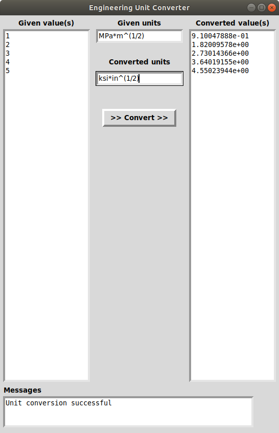

# Engineering Unit Converter
*Lightweight tool for converting units*

## Summary
This repository provides the source code for a GUI-based lightweight universal unit conversion software. The engineering unit conversion tool allows the user to type the given and desired units as well as the value to be converted. Typing the units allows greater flexibility and ease-of-use compared with picking the units from a drop down menu. This is especially true for specialized units such as MPa\*m^(1/2) as seen converted to ksi\*in^(1/2) in Figure 1. The tool also allows the user to convert multiple values at once which can speed up conversion of large datasets. 


>*Figure 1. Engineering unit converter GUI*

## Procedure
The procedure employed in the tool to convert the given units to the desired units includes:
1. Reduced the given and desired units into their base (fundamental) units
2. Compare the given and desired base units to ensure consistency
3. Find the conversion factors between each base unit pair
4. Compute the overall conversion factor
5. Apply the overall conversion factor to the given value
6. Output the value in the desired unit system

As mentioned in Step 1, all units are converted to their based units. The base units used in the conversion tool for the SI and US unit systems are shown in Tables 1 and 2, respectively.

*Table 1. SI base units*

| length  | mass | time | temperature |
| ------------- | ------------- | ------------- | ------------- |
|m|kg|s|K|

*Table 2. US base units*

| length  | mass | time | temperature |
| ------------- | ------------- | ------------- | ------------- |
|in|slinch|s|R|

If you desire additional units, they can be added to the  file which is read upon launching the tool.

## Launching Tool
Both python2 and python3 compatible code is provided in this repository. The GUI was developed using the Tkinter library and can be launched by running either of the commands below in the terminal.

*python2*
```
python GUIUnitConverter_200119_Py2.py
```

*python3*
```
python3 GUIUnitConverter_200119_Py3.py
```
